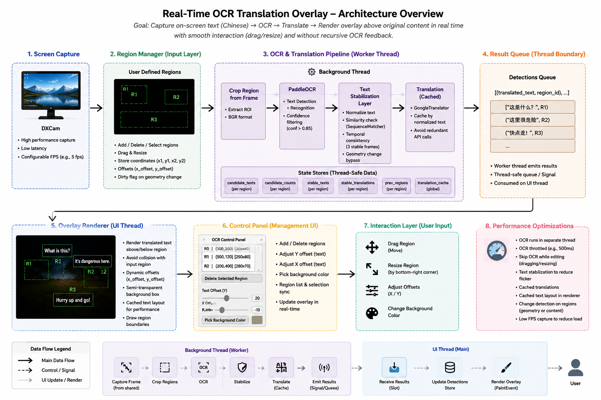

# Real-Time Screen Translation Overlay (Chinese → English)

A desktop overlay application that performs **real-time OCR and translation directly on selected screen regions**, without switching between applications.

Designed for workflows where text is **embedded in images, videos, or UI**, the system extracts and translates content in-place with minimal latency.

Users can define multiple regions and receive translated output directly overlaid on the original content.

## Architecture

## Overview

OCR Overlay enables users to define regions on the screen, perform continuous OCR, and render translated text directly within those regions. The application is designed for minimal UI interference and efficient interaction.

### Demo — Honkai: Star Rail (2× speed)

https://github.com/user-attachments/assets/0d17e8d4-24f4-4054-9020-c28ddd33014f

### Demo - Real-Time Conversation Translation (2x speed)

https://github.com/user-attachments/assets/07f30d68-24cb-4c06-b2b6-b6a9e95ece5c

## Key Features
### Real-Time OCR
- Continuous text detection from selected regions
- Works across browsers, video players, PDFs, and apps

### Text Normalization (Traditional → Simplified)
- Automatically converts Traditional Chinese to Simplified before translation
- Improves translation consistency and accuracy across mixed text sources
- Ensures compatibility with translation models trained on Simplified corpora
  
### In-Place Translation Overlay
- Translated text rendered directly over source
- No workflow interruption

### Multi-Region Support
- Track multiple areas simultaneously
- Independent parameter tuning per region

### Stability Filtering
- Prevents flickering from noisy OCR outputs
- Updates only when text stabilizes

### Lightweight Overlay System
- Minimal UI interference
- Transparent and non-intrusive

## Requirements

- Python 3.10  
- Windows  
- Internet connection (initial setup only)  

## Usage

1. Extract the release package  
2. Run: `run.bat`
3. Initial setup takes time since requirements are being downloaded
4. Press `Ctrl + 1` to toggle edit mode
5. Create and adjust (move / resize) regions to translate as required

## Tweakable Parameters

| Setting           | Description                              |
|------------------|------------------------------------------|
| OCR Interval     | Time between OCR updates (ms)             |
| Stability Frames | Frames required before updating text      |
| Diff Threshold   | Sensitivity to text changes              |
| OCR Confidence   | Minimum confidence threshold              |
| X Offset        | Horizontal adjustment of text position    |
| Y Offset        | Vertical adjustment of text position      |
| Background Color| Set overlay background color              |

## Controls

| Action         | Input          |
|----------------|----------------|
| Toggle mode    | `Ctrl + 1`    |
| Create region  | Click + drag   |
| Move region    | Drag inside    |
| Resize region  | Drag bottom-right edge     |

### Runtime Metrics

| Metric    | Description                     |
|-----------|---------------------------------|
| CPU       | Current CPU usage               |
| OCR/sec   | OCR processing rate             |

## Tech Stack

- PyQt5 - UI & overlay rendering
- PaddleOCR - optimized OCR (Chinese text)
- Deep Translator - high-speed screen capture
- OpenCV / dxcam - translation layer

## Note

- Performance drops according to parameters set
- Currently supports translation from Chinese only.
- Additional language support will be added soon.
